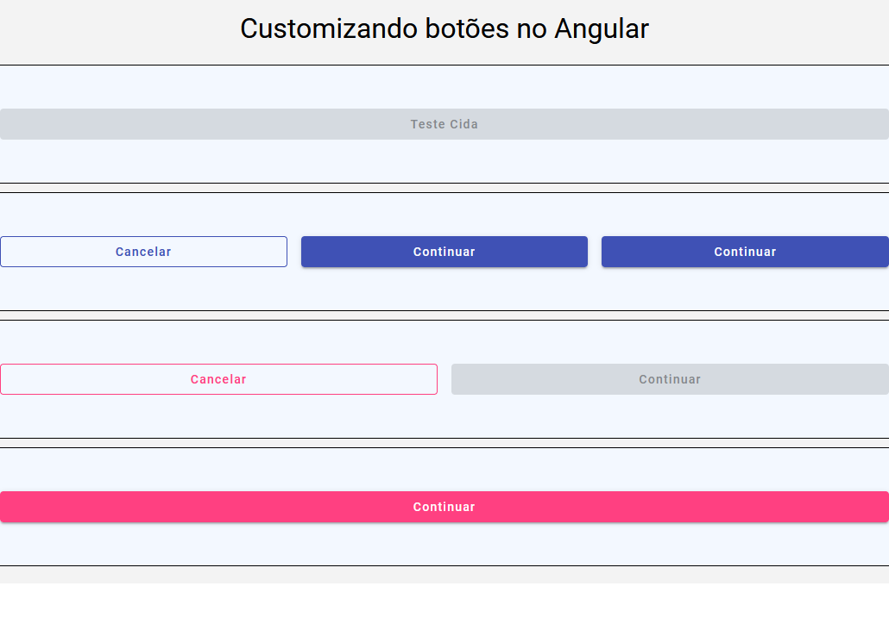

# Angular Custom Elements (em desenvolvimento)

Projeto Angular para customizar elementos em páginas Web.

### Pre-Requisitos
- Node.js ^18
- Angular CLI 17.3.10

### Tecnologias

- Angular 17.3.10, 
- Angular Material 17.3.10,
- Jasmine Karma,
- Node.js,
- Json Server,


## Como rodar a aplicação Angular:

1. **Clone o repositório:**
  ```bash
    git clone https://github.com/cidaluna/angular-custom-elements.git
  ```

2. **Navegue no diretório principal**
```bash
  cd angular-custom-elements
```

3. **Execute o comando JSON Server para acesso a API Backend provisório**
```bash
  json-server --watch db.json --host localhost --port 3000
```

4. **Abra outro terminal, dentro do diretório do projeto e execute o comando**
  ```bash 
    npm install
  ```

5. **Execute a aplicação Angular**
  ```bash 
    ng serve
  ```

6. **Navegue na URL que o comando anterior apresentou**

Após isso, a aplicação estará disponível em: http://localhost:4200


### Problema sem o proxy

Se você fizer uma requisição diretamente por exemplo para http://localhost:3000/users a partir do frontend em http://localhost:4200, isso vai gerar um problema de CORS. O navegador bloqueia a requisição porque está sendo feita para um domínio diferente.

### Solução com o proxy

Com o proxy configurado, você faz uma chamada para http://localhost:4200/api/users, e o Angular CLI redireciona isso internamente para http://localhost:3000/users, resolvendo o problema de CORS sem precisar configurar cabeçalhos especiais no Back-end, por enquanto.

### Proxy somente em ambiente de Desenvolvimento

O proxy é ideal para desenvolvimento, mas em produção, as chamadas devem ser feitas diretamente para o backend real. Usar um proxy em produção pode adicionar latência e complexidade desnecessária.


Tela de botões do Angular Material customizados:



Tela com layout reutilizável:

